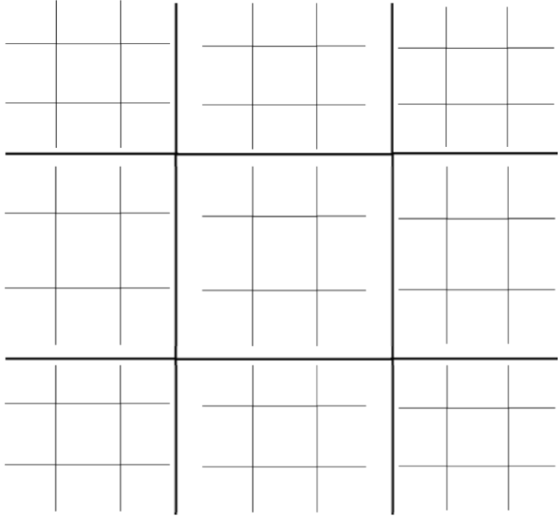

# CAHIER DES CHARGES :

# Tic Tac Toe ²

# Liste du cahier des charges

- Intitulé du projet
- Structures de données utilisées pour modéliser le projet
- Liste de toutes les fonctions et leurs spécifications détaillés
- enchainement des fonctions

---

# Tic Tac Toe ²

---

## Intitulé du projet et règles du jeu :

     Le principe de ce jeux est très simple, inspiré du célèbre jeu du Tic Tac Toe, ou morpion, ce jeu lui rend hommage en le rendant plus challengeant. En effet, il s’agit d’un morpion … dans un morpion ! (d’où son nom de Tic Tac Toe ²). Le but est donc de faire un ligne sur le grand tableau en gagnant chaque morpions 1 par 1

     Pour les règles du jeu, c’est très simple, enfin presque … .

Le jeu commence avec un plateau de 3*3 comportant, pour chaque “case” un autre tableau de 3*3 (soit un plateau de Sudoku).

Le joueur 1 commence à jouer sur le plateau du centre. Il est libre de jouer n’importe ou sur **le plateau du milieu.**

Si le joueur 1 joue en **haut à gauche** :

le joueur 2 devra jouer sur le plateau situé en **haut a gauche**

Si le joueur 1 joue en **haut au milieu** :

     le joueur 2 devra jouer sur le plateau situé en **haut au milieu**

Si le joueur 1 joue en **haut à droite** :

     le joueur 2 devra jouer sur le plateau situé en **haut a droite**

Si le joueur 1 joue au **milieu à gauche** :

     le joueur 2 devra jouer sur le plateau situé au **milieu** **a gauche**

Si le joueur 1 joue au **milieu au milieu** :

     le joueur 2 devra jouer sur le plateau situé au **milieu au milieu**

Si le joueur 1 joue au **milieu à droite** :

     le joueur 2 devra jouer sur le plateau situé au **milieu a droite**

Si le joueur 1 joue en **bas à gauche** :

     le joueur 2 devra jouer sur le plateau situé en **bas a gauche**

Si le joueur 1 joue en **bas au milieu** :

     le joueur 2 devra jouer sur le plateau situé en **bas au milieu**

Si le joueur 1 joue en **bas à droite** :

     le joueur 2 devra jouer sur le plateau situé en **bas a droite**

*et ainsi de suite*

***Les exceptions :***

Si un joueur remporte un plateau, au tour suivant, le joueur suit le principe basique détaillé au dessus.

Si le joueur joue de manière à ce que le prochain joueur doive jouer sur un plateau déjà gagner par un des joueurs : 

     au tour suivant, le joueur joue dans la même case

Si un joueur remporte un plateau et qu’il joue de manière à ce que le prochain joueur doive jouer sur un plateau déjà gagner par un des joueurs : 

le prochain joueur est libre de jouer ou il veut

Si un plateau n’est plus accessible, les joueurs devrons y jouer une fois plus de plateau ni possibilités disponibles (sauf si le cas précédent se présente où le joueur est libre de jouer ou il veut).

Si un des plateau se solde par une égalité, le plateau en question redevient vierge

***Comment gagner :***

Une fois un plateau remporté par un joueur, il prend le signe de celui ci. Le but est d’en gagner 3 aligné horizontalement, verticalement, ou diagonalement sur le “grand” plateau à la manière d’un morpion classique

***Durée moyenne d’une partie :***

Une partie classique peut durer entre 15 à 20 min

---

## Structures de données utilisées pour modéliser le projet

---

## Liste de toutes les fonctions et leurs spécifications détaillés

---

## Enchaînement des fonctions

---

### Liste des tâches à faire

- Règles principales